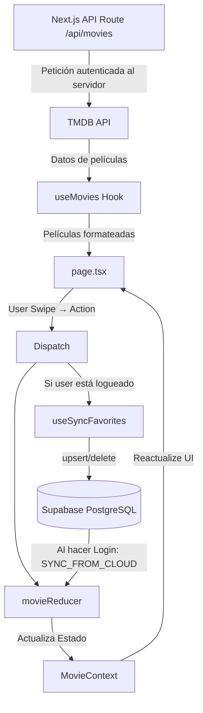

# Arquitectura del Proyecto: CineSwipe

CineSwipe es una aplicación de descubrimiento de películas con experiencia táctil completa. Este documento detalla la estructura de directorios, flujo de datos, responsabilidades de módulos y convenciones del proyecto tras la migración a **Next.js 14 (App Router)**.

## 1. Estructura de Directorios

```text
src/
├── app/                    # Next.js App Router (núcleo de la aplicación)
│   ├── api/
│   │   └── movies/
│   │       └── route.ts    # Proxy seguro para TMDB (Server-Side Route Handler)
│   ├── layout.tsx          # Root Layout: metadatos SEO globales, fuentes, MovieProvider
│   └── page.tsx            # Página principal: Stack de SwipeCards (Client Component)
│
├── components/             # Componentes de presentación (UI pura)
│   ├── auth/
│   │   └── AuthModal.tsx   # Modal de Login/Registro con Framer Motion
│   └── movies/
│       └── SwipeCard.tsx   # Carta interactiva con gestos y animaciones Framer Motion
│
├── context/                # Gestión de estado global
│   └── MovieContext.tsx    # MovieProvider, movieReducer, useMovieHistory, useMovieActions
│
├── hooks/                  # Lógica de negocio reutilizable
│   ├── useAuth.ts          # Sesión de usuario vía Supabase Auth
│   ├── useMovies.ts        # Fetching de TMDB con caché y paginación
│   └── useSyncFavorites.ts # Puente entre el reducer local y Supabase PostgreSQL
│
├── lib/                    # Inicialización de servicios externos
│   └── supabaseClient.ts   # Cliente singleton de Supabase
│
├── types/                  # Contratos de TypeScript
│   └── tmdb.types.ts       # Interfaces de TMDB API y caché
│
├── utils/                  # Funciones auxiliares y constantes
│
└── index.css               # Estilos base, directivas Tailwind y custom scrollbar
```

## 2. Responsabilidades de Módulos

| Módulo | Responsabilidad | Archivos Clave |
| :--- | :--- | :--- |
| **`app/`** | Routing, SEO y punto de entrada de Next.js. | `layout.tsx`, `page.tsx`, `api/movies/route.ts` |
| **`context/`** | Estado global (likes, dislikes, historial). Single Source of Truth. | `MovieContext.tsx` |
| **`hooks/`** | Lógica de negocio: fetching, autenticación y sincronización. | `useMovies.ts`, `useAuth.ts`, `useSyncFavorites.ts` |
| **`components/`** | UI pura. Reciben props, no contienen lógica de negocio pesada. | `SwipeCard.tsx`, `AuthModal.tsx` |
| **`lib/`** | Inicialización única de servicios (Supabase). | `supabaseClient.ts` |
| **`types/`** | Aseguran integridad de datos. Contratos estrictos. | `tmdb.types.ts` |

## 3. Flujo de Datos

El flujo sigue un patrón unidireccional, con un nivel adicional de persistencia en la nube.



## 4. Seguridad — Variables de Entorno

Un principio clave de la arquitectura post-migración es la separación entre variables públicas y privadas:

| Variable | Prefijo | Disponible en | Razón |
| :--- | :--- | :--- | :--- |
| `TMDB_TOKEN` | Ninguno | Solo servidor | Nunca exponer la API Key en el cliente |
| `NEXT_PUBLIC_SUPABASE_URL` | `NEXT_PUBLIC_` | Cliente y servidor | El SDK de Supabase lo necesita en el browser |
| `NEXT_PUBLIC_SUPABASE_ANON_KEY` | `NEXT_PUBLIC_` | Cliente y servidor | Es una key pública por diseño (Row Level Security la protege) |

## 5. Convenciones de Naming

1.  **Componentes**: `PascalCase` (ej: `SwipeCard.tsx`).
2.  **Hooks**: `camelCase` con prefijo `use` (ej: `useSyncFavorites.ts`).
3.  **Lib/Servicios**: `camelCase` (ej: `supabaseClient.ts`).
4.  **Estilos**: Clases de Tailwind directamente en el JSX; si son extensas, se extraen con `@apply` en `index.css`.
5.  **Client Components**: Todo archivo que use hooks de React o eventos del navegador debe comenzar con la directiva `'use client'` en la primera línea.

## 6. Decisiones de Arquitectura

Consulta [DECISIONS.md](./DECISIONS.md) para el razonamiento completo detrás de cada tecnología elegida.
