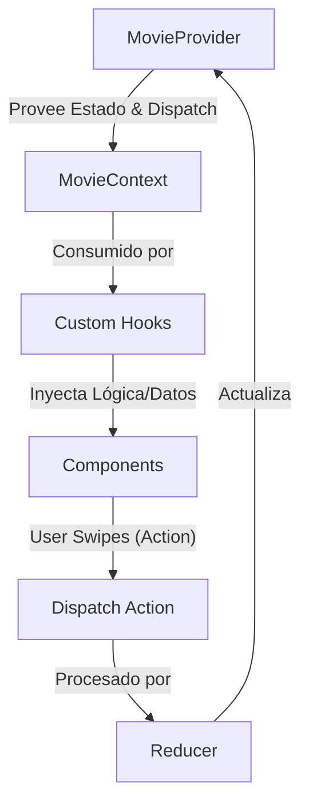

# Arquitectura del Proyecto: CineSwipe

CineSwipe es una aplicación de descubrimiento de películas diseñada para una experiencia fluida y táctil. Este documento detalla la estructura, flujo de datos y convenciones seguidas en el desarrollo.

## 1. Estructura de Directorios

```text
src/
├── assets/             # Recursos estáticos (imágenes, iconos, SVGs)
├── components/         # Componentes de presentación (Pure Components)
│   ├── common/         # UI Genérica (Botones, Inputs, Modales)
│   ├── layout/         # Estructura de página (Header, Sidebar, Footer)
│   └── movies/         # Componentes específicos del dominio de películas
├── context/            # Gestión de estado global (Context API + useReducer)
├── hooks/              # Lógica de negocio reusable y Custom Hooks
├── services/           # Capa de abstracción de API (Fetch/Axios)
├── types/              # Definiciones de TypeScript e Interfaces
├── utils/              # Funciones auxiliares y constantes
├── App.tsx             # Punto de entrada de la aplicación
└── main.tsx            # Configuración de React y Vite
```

## 2. Responsabilidades de Módulos

| Módulo | Responsabilidad | Archivos Clave |
| :--- | :--- | :--- |
| **Context** | Centraliza el estado global (likes, dislikes, filtros). Actúa como la "Single Source of Truth". | `MovieContext.tsx`, `movieReducer.ts` |
| **Hooks** | Encapsula la lógica de swipe, llamadas a API y sincronización de estado. Separa la lógica de la UI. | `useSwipe.ts`, `useMovies.ts` |
| **Components** | Reciben props para renderizar la UI. No contienen lógica de negocio pesada, solo eventos locales. | `SwipeCard.tsx`, `FilterSidebar.tsx` |
| **Services** | Configuración de clientes API y funciones de fetch específicas para TMDB u otros proveedores. | `movieService.ts`, `apiClient.ts` |
| **Types** | Aseguran la integridad de los datos en toda la aplicación mediante contratos estrictos. | `movie.types.ts`, `state.types.ts` |

## 3. Flujo de Datos

El flujo de datos sigue un patrón unidireccional, apoyado por el hook `useReducer` para transiciones de estado complejas.



## 4. Convenciones de Naming

1.  **Componentes**: `PascalCase` (ej: `MovieCard.tsx`).
2.  **Hooks**: `camelCase` con prefijo `use` (ej: `useMovieFilter.ts`).
3.  **Servicios/Utils**: `camelCase` (ej: `fetchMovies.ts`).
4.  **Estilos**: Clases de Tailwind directamente en el JSX; si son muy extensas, se extraen mediante `@apply` en `index.css`.
5.  **Interfaces/Types**: `PascalCase` (ej: `MovieResponse`).

## 5. Decisiones de Arquitectura

-   **State Management**: Se optó por **React Context + useReducer** para evitar dependencias externas pesadas (Redux/Zustand), aprovechando las capacidades nativas de React 18 para el manejo de estados complejos.
-   **Separación de Preocupaciones**: Los componentes en `src/components` deben ser lo más puros posible. Toda la lógica de fetching o manipulación de datos debe residir en `src/hooks`.
-   **Profundidad Limitada**: Se mantiene un máximo de 3 niveles de profundidad para facilitar la navegación y mantenibilidad del proyecto.
